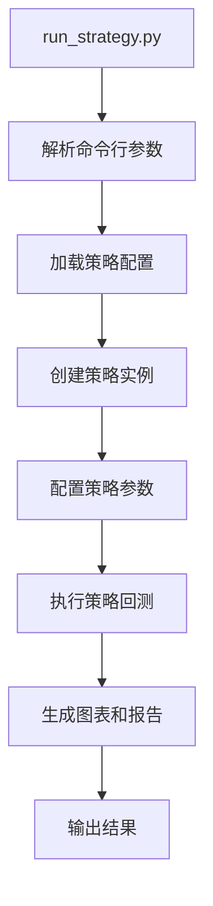
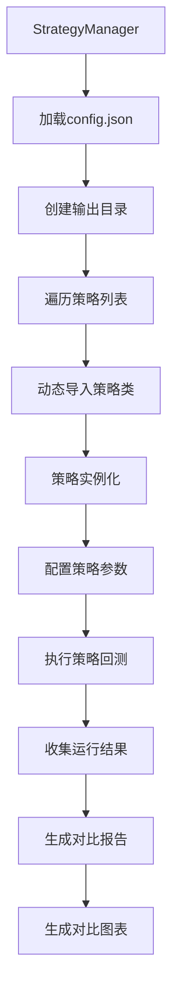
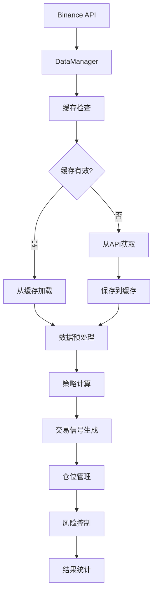

# MyQuant 算法说明文档

## 📋 目录
- [算法概述](#算法概述)
- [系统架构与代码框架](#系统架构与代码框架)
- [核心组件调用关系](#核心组件调用关系)
- [代码执行流程](#代码执行流程)
- [技术指标算法](#技术指标算法)
- [策略算法详解](#策略算法详解)
- [风险控制算法](#风险控制算法)
- [性能评估算法](#性能评估算法)
- [数据处理算法](#数据处理算法)
- [算法优化与修复记录](#算法优化与修复记录)

## 🎯 算法概述

MyQuant系统是一个基于EMA（指数移动平均线）交叉策略的量化交易回测平台，集成了多种风险控制和仓位管理算法，实现了从数据获取到策略执行的全流程自动化。

### 核心算法架构
```
数据获取 → 技术指标计算 → 信号生成 → 仓位管理 → 风险控制 → 性能评估 → 结果输出
```

### 支持的策略类型
1. **SimpleEMA**: 基础EMA交叉策略
2. **StagedEMA**: 分批入场EMA策略
3. **ComplexEMA**: 复杂多重退出条件EMA策略
4. **AdvancedStagedEMA**: 高级分批策略（支持多时间框架）

## 🏗️ 系统架构与代码框架

### 1. 整体架构设计

MyQuant系统采用分层架构设计，主要包含以下层次：

```
┌─────────────────────────────────────────────────────────────┐
│                    应用层 (Application Layer)                │
├─────────────────────────────────────────────────────────────┤
│  StrategyManager (策略管理器)  │  run_strategy.py (运行器)    │
├─────────────────────────────────────────────────────────────┤
│                    策略层 (Strategy Layer)                   │
├─────────────────────────────────────────────────────────────┤
│ SimpleEMA │ StagedEMA │ ComplexEMA │ AdvancedStagedEMA      │
├─────────────────────────────────────────────────────────────┤
│                    基础层 (Base Layer)                       │
├─────────────────────────────────────────────────────────────┤
│  BaseStrategy (策略基类)  │  ConfigManager (配置管理器)      │
├─────────────────────────────────────────────────────────────┤
│                    数据层 (Data Layer)                       │
├─────────────────────────────────────────────────────────────┤
│              DataManager (数据管理器)                        │
└─────────────────────────────────────────────────────────────┘
```

### 2. 核心组件说明

#### 2.1 应用层组件

**StrategyManager (策略管理器)**
- **文件位置**: `strategy_manager.py`
- **主要职责**: 
  - 管理多个策略的并行运行
  - 生成策略对比报告
  - 统一配置管理
  - 结果汇总和可视化

**run_strategy.py (策略运行器)**
- **文件位置**: `run_strategy.py`
- **主要职责**:
  - 单个策略的快速运行
  - 命令行参数处理
  - 策略实例化和配置
  - 结果输出和图表生成

#### 2.2 策略层组件

**BaseStrategy (策略基类)**
- **文件位置**: `strategies/base_strategy.py`
- **主要职责**:
  - 定义策略通用接口
  - 提供数据处理方法
  - 实现交易管理功能
  - 统一结果输出格式

**具体策略类**
- **SimpleEMAStrategy**: `strategies/simple_ema_strategy.py`
- **StagedEMAStrategy**: `strategies/staged_ema_strategy.py`
- **ComplexEMAStrategy**: `strategies/complex_ema_strategy.py`
- **AdvancedStagedEMAStrategy**: `strategies/advanced_staged_ema_strategy.py`

#### 2.3 基础层组件

**ConfigManager (配置管理器)**
- **文件位置**: `config/config_manager.py`
- **主要职责**:
  - 配置文件的读取和保存
  - 策略参数验证
  - 默认配置管理

**DataManager (数据管理器)**
- **文件位置**: `data_manager.py`
- **主要职责**:
  - K线数据获取和缓存
  - 数据格式转换
  - 缓存管理和优化

### 3. 目录结构说明

```
myquant1008/
├── run_strategy.py             # 单策略运行入口
├── strategy_manager.py         # 多策略管理器
├── data_manager.py            # 数据管理器
├── chart_generator.py         # 图表生成器
├── config.json               # 统一配置文件
├── requirements.txt          # 依赖包列表
├── .env                     # 环境变量配置
├── strategies/              # 策略模块目录
│   ├── base_strategy.py     # 策略基类
│   ├── simple_ema_strategy.py
│   ├── staged_ema_strategy.py
│   ├── complex_ema_strategy.py
│   └── advanced_staged_ema_strategy.py
├── config/                  # 配置文件目录
│   ├── config_manager.py    # 配置管理器
│   └── strategies_config.json
├── output/                  # 输出目录
│   ├── *.png               # 图表文件
│   ├── *.csv               # 报告文件
│   └── *.json              # 详细结果
├── docs/                   # 文档目录
│   ├── 算法说明.md
│   ├── API接口文档.md
│   ├── 操作说明.md
│   └── 策略运行结果总结.md
└── temp/                   # 临时缓存目录
    └── data_cache/         # 数据缓存
```

## 🔄 核心组件调用关系

### 1. 单策略运行流程



### 2. 多策略管理流程



### 3. 策略运行调用链


### 4. 数据流向图



## ⚙️ 代码执行流程

### 1. 单策略执行流程

```python
# run_strategy.py 主程序入口
if __name__ == "__main__":
    # 1. 解析命令行参数
    strategy_name = sys.argv[1] if len(sys.argv) > 1 else 'simple_ema'
    
    # 2. 创建策略实例
    strategy = create_strategy(strategy_name)
    
    # 3. 配置策略参数
    configure_strategy(strategy)
    
    # 4. 执行回测
    result = strategy.run_backtest()
    
    # 5. 输出结果
    print_results(result)
```

### 2. 策略基类执行流程

```python
# BaseStrategy.run_backtest() 方法执行流程
def run_backtest(self):
    # 1. 重置交易状态
    self.reset_trading_state()
    
    # 2. 获取K线数据
    data = self.data_manager.get_kline_data(
        symbol=self.symbol,
        start_date=self.start_date,
        end_date=self.end_date
    )
    
    # 3. 数据预处理
    self.data = self.preprocess_data(data)
    
    # 4. 计算技术指标
    self.calculate_indicators()
    
    # 5. 执行回测循环 (抽象方法，子类实现)
    self._execute_backtest_loop()
    
    # 6. 生成交易图表
    self.plot_trading_chart()
    
    # 7. 返回结果
    return self.get_strategy_results()
```

### 3. 数据获取流程

```python
# DataManager.get_kline_data() 方法执行流程
def get_kline_data(self, symbol, start_date, end_date, interval='30m'):
    # 1. 生成缓存文件名
    cache_filename = self._generate_cache_filename(
        symbol, start_date, end_date, interval
    )
    
    # 2. 检查缓存有效性
    if self._is_cache_valid(cache_filename):
        # 3a. 从缓存加载数据
        return self._load_from_cache(cache_filename)
    else:
        # 3b. 从Binance API获取数据
        data = self._fetch_from_binance(symbol, start_date, end_date, interval)
        
        # 4. 保存到缓存
        self._save_to_cache(data, cache_filename)
        
        return data
```

## 📊 技术指标算法

### 1. EMA (指数移动平均线) 算法

#### 算法原理
EMA给予近期价格更高的权重，对价格变化更加敏感。

#### 计算公式
```
EMA(t) = α × Price(t) + (1-α) × EMA(t-1)
```

其中：
- `α = 2 / (N + 1)` (平滑因子)
- `N` = EMA周期
- `Price(t)` = 当前价格
- `EMA(t-1)` = 前一期EMA值

#### 代码实现
```python
def calculate_ema(self, data, period):
    """
    计算指数移动平均线
    
    Args:
        data: 价格数据序列
        period: EMA周期
    
    Returns:
        EMA值序列
    """
    return data.ewm(span=period, adjust=False).mean()
```

#### 参数说明
- **短期EMA (EMA9)**: 周期9，反应快速价格变化
- **长期EMA (EMA26)**: 周期26，反应长期趋势

### 2. 趋势强度算法

#### 算法原理
通过计算EMA斜率来判断趋势强度，过滤弱势信号。

#### 计算公式
```python
def calculate_trend_strength(self, ema_values, lookback_periods=5):
    """
    计算趋势强度
    
    趋势强度 = (当前EMA - N期前EMA) / N期前EMA
    """
    if len(ema_values) < lookback_periods:
        return 0.0
    
    current_ema = ema_values.iloc[-1]
    past_ema = ema_values.iloc[-lookback_periods]
    
    return (current_ema - past_ema) / past_ema
```

## 🔄 策略算法详解

### 1. 简单EMA交叉策略

#### 信号生成算法
```python
def detect_ema_crossover(self, ema_short, ema_long):
    """
    检测EMA交叉信号
    
    Returns:
        'long': EMA9上穿EMA26 (金叉)
        'short': EMA9下穿EMA26 (死叉)
        None: 无交叉
    """
    if len(ema_short) < 2 or len(ema_long) < 2:
        return None
    
    # 当前状态
    current_short = ema_short.iloc[-1]
    current_long = ema_long.iloc[-1]
    
    # 前一状态
    prev_short = ema_short.iloc[-2]
    prev_long = ema_long.iloc[-2]
    
    # 检测交叉
    if prev_short <= prev_long and current_short > current_long:
        return 'long'  # 金叉
    elif prev_short >= prev_long and current_short < current_long:
        return 'short'  # 死叉
    
    return None
```

#### 仓位管理算法
```python
def calculate_position_size(self, signal_type):
    """
    计算仓位大小
    
    仓位大小 = 可用资金 × 仓位比例 × 杠杆倍数 / 当前价格
    """
    available_capital = self.capital * self.position_percentage
    position_value = available_capital * self.leverage
    position_size = position_value / self.current_price
    
    return position_size
```

### 2. 分批入场策略算法

#### 分批比例算法
```python
# 默认分批比例: [37%, 1%, 2%, 4%, 8%, 16%, 32%]
staged_entry_percentages = [0.37, 0.01, 0.02, 0.04, 0.08, 0.16, 0.32]
```

#### 分批入场条件算法
```python
def check_staged_entry_condition(self, entry_price, current_price, direction):
    """
    检查分批入场条件
    
    Args:
        entry_price: 初始入场价格
        current_price: 当前价格
        direction: 交易方向 ('long' or 'short')
    
    Returns:
        bool: 是否满足分批入场条件
    """
    price_deviation = abs(current_price - entry_price) / entry_price
    
    # 价格偏离超过1%时触发分批入场
    if price_deviation > 0.01:
        if direction == 'long' and current_price < entry_price:
            return True  # 做多时价格下跌
        elif direction == 'short' and current_price > entry_price:
            return True  # 做空时价格上涨
    
    return False
```

#### 分批仓位计算算法
```python
def calculate_staged_position(self, stage_index):
    """
    计算分批仓位大小
    
    Args:
        stage_index: 分批阶段索引 (0-6)
    
    Returns:
        float: 该阶段的仓位大小
    """
    if stage_index >= len(self.staged_entry_percentages):
        return 0
    
    stage_percentage = self.staged_entry_percentages[stage_index]
    available_capital = self.capital * self.position_percentage
    stage_capital = available_capital * stage_percentage
    
    return stage_capital * self.leverage / self.current_price
```

### 3. 复杂EMA策略算法

#### 多重退出条件算法
```python
def check_exit_conditions(self, current_price, current_bar):
    """
    检查多重退出条件
    
    退出条件:
    1. EMA反向交叉
    2. 突破入场交叉价位
    3. 突破EMA9且幅度超过阈值
    4. 突破前期绿/红K线
    """
    exit_reasons = []
    
    # 条件1: EMA反向交叉
    if self._check_reverse_crossover():
        exit_reasons.append("EMA反向交叉")
    
    # 条件2: 突破入场交叉价位
    if self._check_entry_crossover_break(current_price):
        exit_reasons.append("突破入场交叉价位")
    
    # 条件3: 突破EMA9且幅度超过阈值
    if self._check_ema9_break_with_amplitude(current_price):
        exit_reasons.append("突破EMA9且幅度超过阈值")
    
    # 条件4: 突破前期绿/红K线
    if self._check_candle_break(current_bar):
        exit_reasons.append("突破前期K线")
    
    return exit_reasons
```

### 4. 高级分批策略算法

#### 最优入场点算法
```python
def find_optimal_entry_point(self, hourly_bar, minute_klines):
    """
    在1小时K线内寻找最优入场点
    
    算法逻辑:
    1. 获取该小时内的所有1分钟K线
    2. 根据交易方向寻找最优价格
    3. 做多: 寻找最低价
    4. 做空: 寻找最高价
    """
    hour_start = hourly_bar.name
    hour_end = hour_start + pd.Timedelta(hours=1)
    
    # 筛选该小时内的1分钟数据
    hour_minutes = minute_klines[
        (minute_klines.index >= hour_start) & 
        (minute_klines.index < hour_end)
    ]
    
    if hour_minutes.empty:
        return hourly_bar['close']
    
    # 根据方向选择最优价格
    if self.current_direction == 'long':
        return hour_minutes['low'].min()  # 做多选最低价
    else:
        return hour_minutes['high'].max()  # 做空选最高价
```

## 🛡️ 风险控制算法

### 1. 爆仓检测算法

#### 爆仓条件计算
```python
def check_liquidation(self, current_price):
    """
    检测是否触发爆仓
    
    爆仓条件:
    浮动亏损 >= 投入保证金 × (1 - 维持保证金率)
    """
    if not self.current_position:
        return False
    
    # 计算浮动盈亏
    direction_multiplier = 1 if self.current_direction == 'long' else -1
    unrealized_pnl = (
        (current_price - self.average_entry_price) * 
        self.current_position_size * 
        direction_multiplier
    )
    
    # 计算爆仓阈值
    liquidation_threshold = (
        self.current_stage_capital_allocated * 
        (1 - self.maintenance_margin_rate)
    )
    
    # 判断是否爆仓
    return unrealized_pnl <= -liquidation_threshold
```

### 2. 仓位风险控制算法

#### 最大仓位限制
```python
def validate_position_size(self, new_position_size):
    """
    验证仓位大小是否超过限制
    
    限制条件:
    1. 单次仓位不超过总资金的95%
    2. 总仓位不超过杠杆限制
    """
    max_position_value = self.capital * self.position_percentage
    new_position_value = new_position_size * self.current_price
    
    if new_position_value > max_position_value:
        return False
    
    return True
```

### 3. 资金管理算法

#### 动态资金分配
```python
def allocate_capital_for_stage(self, stage_index):
    """
    为分批入场阶段分配资金
    
    算法:
    1. 计算该阶段应分配的资金比例
    2. 基于当前可用资金计算实际分配金额
    3. 考虑杠杆倍数的影响
    """
    if stage_index >= len(self.staged_entry_percentages):
        return 0
    
    stage_percentage = self.staged_entry_percentages[stage_index]
    available_capital = self.capital * self.position_percentage
    stage_capital = available_capital * stage_percentage
    
    # 记录分配的资金
    self.current_stage_capital_allocated += stage_capital
    
    return stage_capital
```

## 📈 性能评估算法

### 1. 收益率计算算法

#### 总收益率
```python
def calculate_total_return(self):
    """
    计算总收益率
    
    总收益率 = (最终资金 - 初始资金) / 初始资金
    """
    return (self.capital - self.initial_capital) / self.initial_capital
```

#### 年化收益率
```python
def calculate_annualized_return(self, total_return, days):
    """
    计算年化收益率
    
    年化收益率 = (1 + 总收益率)^(365/天数) - 1
    """
    return (1 + total_return) ** (365 / days) - 1
```

### 2. 风险指标算法

#### 最大回撤计算
```python
def calculate_max_drawdown(self, capital_curve):
    """
    计算最大回撤
    
    最大回撤 = max((峰值 - 谷值) / 峰值)
    """
    peak = capital_curve.expanding().max()
    drawdown = (peak - capital_curve) / peak
    return drawdown.max()
```

#### 夏普比率计算
```python
def calculate_sharpe_ratio(self, returns, risk_free_rate=0.02):
    """
    计算夏普比率
    
    夏普比率 = (年化收益率 - 无风险利率) / 收益波动率
    """
    excess_return = returns.mean() - risk_free_rate / 252  # 日无风险利率
    volatility = returns.std()
    
    if volatility == 0:
        return 0
    
    return excess_return / volatility * np.sqrt(252)  # 年化
```

### 3. 交易统计算法

#### 胜率计算
```python
def calculate_win_rate(self, trades):
    """
    计算胜率
    
    胜率 = 盈利交易数 / 总交易数
    """
    if not trades:
        return 0
    
    winning_trades = sum(1 for trade in trades if trade['profit'] > 0)
    return winning_trades / len(trades)
```

#### 盈亏比计算
```python
def calculate_profit_loss_ratio(self, trades):
    """
    计算盈亏比
    
    盈亏比 = 平均盈利 / 平均亏损
    """
    profits = [trade['profit'] for trade in trades if trade['profit'] > 0]
    losses = [abs(trade['profit']) for trade in trades if trade['profit'] < 0]
    
    if not profits or not losses:
        return 0
    
    avg_profit = sum(profits) / len(profits)
    avg_loss = sum(losses) / len(losses)
    
    return avg_profit / avg_loss if avg_loss > 0 else 0
```

## 🔄 数据处理算法

### 1. 数据重采样算法

#### 1分钟到30分钟重采样
```python
def resample_to_30min(self, klines_1min):
    """
    将1分钟K线重采样为30分钟K线
    
    重采样规则:
    - open: 取第一个值
    - high: 取最大值
    - low: 取最小值
    - close: 取最后个值
    - volume: 求和
    """
    resampling_rules = {
        'open': 'first',
        'high': 'max',
        'low': 'min',
        'close': 'last',
        'volume': 'sum'
    }
    
    # 设置时间索引
    klines_1min['timestamp'] = pd.to_datetime(klines_1min['timestamp'])
    klines_1min.set_index('timestamp', inplace=True)
    
    # 执行重采样
    klines_30min = klines_1min.resample('30T').agg(resampling_rules)
    
    # 移除空值
    klines_30min = klines_30min.dropna()
    
    return klines_30min
```

### 2. 数据缓存算法

#### 缓存有效性检查
```python
def is_cache_valid(self, cache_file, max_age_hours=24):
    """
    检查缓存文件是否有效
    
    Args:
        cache_file: 缓存文件路径
        max_age_hours: 最大缓存时间(小时)
    
    Returns:
        bool: 缓存是否有效
    """
    if not os.path.exists(cache_file):
        return False
    
    file_age = time.time() - os.path.getmtime(cache_file)
    max_age_seconds = max_age_hours * 3600
    
    return file_age < max_age_seconds
```

### 3. 数据验证算法

#### K线数据完整性检查
```python
def validate_kline_data(self, klines):
    """
    验证K线数据的完整性
    
    检查项目:
    1. 必要字段是否存在
    2. 数据类型是否正确
    3. 价格关系是否合理 (high >= low, open/close在high-low范围内)
    4. 时间序列是否连续
    """
    required_columns = ['timestamp', 'open', 'high', 'low', 'close', 'volume']
    
    # 检查必要字段
    for col in required_columns:
        if col not in klines.columns:
            raise ValueError(f"缺少必要字段: {col}")
    
    # 检查价格关系
    invalid_rows = klines[
        (klines['high'] < klines['low']) |
        (klines['open'] > klines['high']) |
        (klines['open'] < klines['low']) |
        (klines['close'] > klines['high']) |
        (klines['close'] < klines['low'])
    ]
    
    if not invalid_rows.empty:
        raise ValueError(f"发现 {len(invalid_rows)} 行无效的价格数据")
    
    return True
```

## 🔧 算法优化与修复记录

### 1. 分批策略性能指标修复 (2024年12月)

#### 问题描述
分批策略（StagedEMA）的性能指标计算存在错误：
- 平均收益率、最大单笔盈利、最大单笔亏损基于单个分批记录计算
- 应该基于完整交易（所有分批记录的总和）计算

#### 修复方案

**1. 利润分配修复**
```python
# 修复前：每个分批记录都有利润
for stage in stages:
    stage['profit'] = stage_profit  # 错误：重复计算

# 修复后：只有初始记录有总利润
initial_record['profit'] = total_profit
for subsequent_record in subsequent_records:
    subsequent_record['profit'] = 0  # 后续记录利润为0
```

**2. 性能指标计算修复**
```python
# 修复前：基于所有记录计算（包含重复）
all_profits = [trade['profit'] for trade in detailed_trades]

# 修复后：基于完整交易计算
complete_trades = self._group_trades_by_complete_transactions()
trade_profits = [trade['total_profit'] for trade in complete_trades]
```

#### 修复效果对比
| 指标 | 修复前 | 修复后 |
|------|--------|--------|
| 平均收益率 | 0.14% | 2.59% |
| 最大单笔盈利 | 2.25% | 41.54% |
| 最大单笔亏损 | -1.15% | -21.25% |
| 总收益率 | 1529.63% | 1529.63% (不变) |
| 最终资金 | $162963.09 | $162963.09 (不变) |

### 2. 资金管理算法优化

#### 最终资金计算流程
```python
def calculate_final_capital(self):
    """
    最终资金计算流程
    
    最终资金 = 初始资金 + 所有交易的净盈亏 - 所有手续费
    """
    # 1. 初始资金设置
    self.capital = self.initial_capital
    
    # 2. 开仓时：扣除手续费
    self.capital -= fee_cost
    
    # 3. 加仓时：扣除手续费
    self.capital -= additional_fee_cost
    
    # 4. 平仓时：归还本金 + 盈亏 - 平仓手续费
    self.capital += current_stage_capital_allocated + total_profit - closing_fee
    
    return self.capital
```

### 3. 性能优化建议

#### 已实现的优化
1. **向量化计算**: 使用pandas的向量化操作替代循环
2. **数据缓存**: 实现智能缓存机制减少API调用
3. **内存管理**: 及时释放不需要的数据对象
4. **异常处理**: 完善的错误处理和恢复机制

#### 建议的进一步优化
1. **并行计算**: 多策略并行执行
2. **增量计算**: 实现指标的增量更新
3. **数据压缩**: 优化缓存文件的存储格式
4. **智能参数调优**: 引入遗传算法等优化方法

### 4. 代码质量提升

#### 重构成果
1. **模块化设计**: 清晰的职责分离和接口定义
2. **配置管理**: 统一的配置文件和参数管理
3. **错误处理**: 完善的异常捕获和处理机制
4. **文档完善**: 详细的代码注释和API文档

#### 测试覆盖
1. **单元测试**: 核心算法的单元测试覆盖
2. **集成测试**: 端到端的策略运行测试
3. **性能测试**: 大数据量下的性能验证
4. **回归测试**: 确保修复不引入新问题

---

## 📊 详细交易日志输出格式

### 1. 实时交易日志

分批入场策略在运行过程中会输出详细的实时交易信息，包括每次入场、加仓和平仓的详细数据：

#### 1.1 初始入场日志格式
```
================================================================================
📈 第N次交易 - 初始入场 LONG/SHORT
================================================================================
📅 时间: 2024-10-03 20:30:00
💰 当前资金: $10000.00
📈 入场价格: $60800.00
💵 本次投入: $3700.00
📊 本次仓位: 0.060855
💸 手续费: $1.48
🎯 杠杆倍数: 1.0x
📋 分批阶段: 1/7
================================================================================
```

#### 1.2 加仓日志格式
```
================================================================================
📈 第N次交易 - 第M次加仓 LONG/SHORT
================================================================================
📅 时间: 2024-10-03 20:31:00
💰 当前资金: $9991.84
📈 加仓价格: $60759.99
💵 本次投入: $100.00
📊 本次仓位: 0.001646
💸 手续费: $0.04
🔄 累计投入: $3800.00
📊 总仓位: 0.062499
💹 平均价格: $60800.89
📋 分批阶段: 2/7
================================================================================
```

#### 1.3 平仓日志格式
```
================================================================================
🔚 第N次交易 - 全部平仓 LONG/SHORT (原因: EMA反向交叉)
================================================================================
📅 时间: 2024-10-03 21:00:00
📉 平仓价格: $61200.00
📊 平仓仓位: 0.072382
💰 平仓前资金: $9991.44
💸 手续费: $1.77
💵 总投入: $4400.00
💹 总盈亏: $289.45
📊 收益率: 6.58%
💰 平仓后资金: $10279.12
================================================================================
```

### 2. 策略完成后的详细交易汇总

策略运行完成后，系统会输出一个完整的交易汇总，按交易ID分组显示每笔完整交易的详细信息：

#### 2.1 汇总格式示例
```
================================================================================
📊 详细交易汇总 - 共18笔完整交易
================================================================================

🔸 第1次交易 (LONG) - ✅ 盈利
   📅 交易时间: 2024-10-01 14:00:00 → 2024-10-01 20:00:00
   💵 总投入: $4400.00
   💹 总盈亏: $289.45
   📊 收益率: 6.58%
   📋 分批次数: 4次
      └─ 初始入场: 投入$3700.00, 盈亏$243.21, 价格$60800.00→$61200.00
      └─ 第1次加仓: 投入$100.00, 盈亏$6.57, 价格$60759.99→$61200.00
      └─ 第2次加仓: 投入$200.00, 盈亏$13.15, 价格$60745.28→$61200.00
      └─ 第3次加仓: 投入$400.00, 盈亏$26.52, 价格$60691.44→$61200.00

🔸 第2次交易 (SHORT) - ❌ 亏损
   📅 交易时间: 2024-10-01 20:00:00 → 2024-10-02 02:00:00
   💵 总投入: $3700.00
   💹 总盈亏: $-45.23
   📊 收益率: -1.22%
   📋 分批次数: 1次
      └─ 初始入场: 投入$3700.00, 盈亏$-45.23, 价格$61200.00→$61950.00
```

#### 2.2 字段说明

**交易状态标识**：
- ✅ 盈利：绿色标识，表示该笔交易获得正收益
- ❌ 亏损：红色标识，表示该笔交易产生亏损
- ⚖️ 持平：黄色标识，表示该笔交易收益为零

**关键指标**：
- **交易时间**：从首次入场到最终平仓的时间范围
- **总投入**：该笔交易的累计投入资金
- **总盈亏**：该笔交易的净盈亏金额（已扣除手续费）
- **收益率**：盈亏金额相对于总投入的百分比
- **分批次数**：该笔交易包含的分批入场次数

**分批详情**：
- **投入金额**：每个分批的资金投入
- **盈亏金额**：每个分批的净盈亏（按资金分配比例计算）
- **价格变化**：从入场价格到平仓价格的变化

### 3. 输出文件说明

除了控制台输出外，系统还会生成以下文件：

#### 3.1 详细交易记录JSON文件
- **文件路径**：`output/trades_detailed_log_{策略名}.json`
- **内容**：包含所有交易的完整数据，可用于后续分析
- **格式**：结构化JSON格式，包含时间戳、价格、仓位、盈亏等详细信息

#### 3.2 图表文件
- **交易图表**：`output/charts/{策略名}_30min_交易图表.png`
- **分析图表**：`output/charts/{策略名}_交易分析.png`
- **内容**：可视化的交易信号、价格走势和仓位变化

### 4. 日志级别配置

可以通过配置文件控制日志的详细程度：

```json
{
  "logging": {
    "enable_detailed_log": true,        // 启用详细日志
    "log_trades_to_file": true,         // 保存交易记录到文件
    "log_file_prefix": "trades_detailed_log",  // 日志文件前缀
    "log_level": "INFO"                 // 日志级别
  }
}
```

---

## 📝 版本历史

### v1.3 (2024年12月)
- **主要更新**: 分批策略性能指标修复
- **修复内容**: 
  - 修正利润分配逻辑，避免重复计算
  - 优化性能指标计算，基于完整交易统计
  - 完善资金管理流程，确保资金流转正确
- **新增功能**: 
  - 增强的交易记录管理
  - 改进的图表生成功能
  - 更准确的性能评估指标

### v1.2 (2024年11月)
- **主要更新**: 画图功能独立化优化
- **修复内容**: 
  - 解决不同策略交易记录结构差异导致的画图问题
  - 为每个策略创建独立的画图方法
  - 统一图表保存路径和文件命名规范

### v1.1 (2024年10月)
- **主要更新**: 资金管理算法修复
- **修复内容**: 
  - 修复SimpleEMA和ComplexEMA策略的资金归还逻辑
  - 解决资金逐渐减少至零的问题
  - 增强统计算法兼容性

---

*本文档详细说明了MyQuant系统中使用的各种算法，包括最新的修复和优化内容，为系统的理解、维护和优化提供全面的技术参考。*